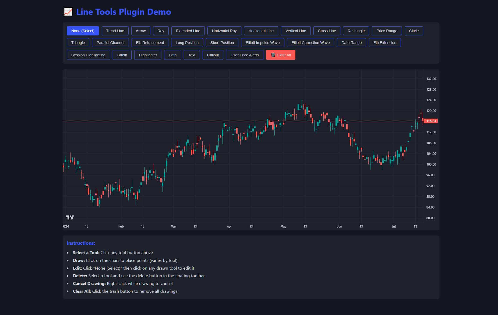

# lightweight-charts-demo

## Getting Started

### Clone the Repository
```bash
git clone https://github.com/crypt0inf0/lightweight-charts-demo.git
cd lightweight-charts-demo
```

### Install Dependencies
```bash
npm install
```

### Start the Demo
```bash
npm start
```

The demo will be available in your browser at the configured development server address.

## Features

- **Drawing Tools**: Trend lines, arrows, rectangles, circles, triangles, and more
- **Chart Annotations**: Text, callouts, and various geometric shapes
- **Advanced Tools**: Elliott Wave patterns, Fibonacci retracements/extensions, price ranges
- **Positions**: Long and short position markers
- **Session Highlighting**: Highlight specific market sessions on the chart
- **Real-time Editing**: Edit or delete drawings with intuitive controls

## Demo Screenshot



## Instructions

- **Select a Tool**: Click any tool button above the chart
- **Draw**: Click on the chart to place points (varies by tool)
- **Edit**: Click "None (Select)" then click on any drawn tool to edit it
- **Delete**: Select a tool and use the delete button in the floating toolbar
- **Cancel Drawing**: Right-click while drawing to cancel
- **Clear All**: Click the trash button to remove all drawings
- **Session Highlighting**: Use the Session Highlighting button to highlight specific market sessions